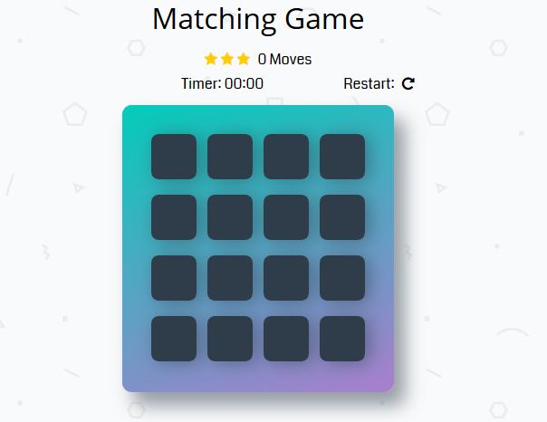

# Memory Game Project
A Udacity project developed using HTMl, CSS, JavaScript and jQuery.

## What is the Memory Game
This is a memory matching card game. The goal is to match each card's icon with its pair. There are 16 cards and 8 pairs total. Click on a card, remember its icon and spot in the grid, then continue clicking other cards until you find its match. The game ends once all pairs are matched.

## Challenge
Keep track of progress in the score panel area by viewing the star raiting, how many moves have been made, and how long it takes to finish the game

## How to Play
Load this link in your browser https://ccobb73.github.io/Memory-Game-fend/

## Instructions
* Click on a card
* Keep revealing cards and working your memory to remember each unveiled card.
* Match cards properly with less moves and in faster time
